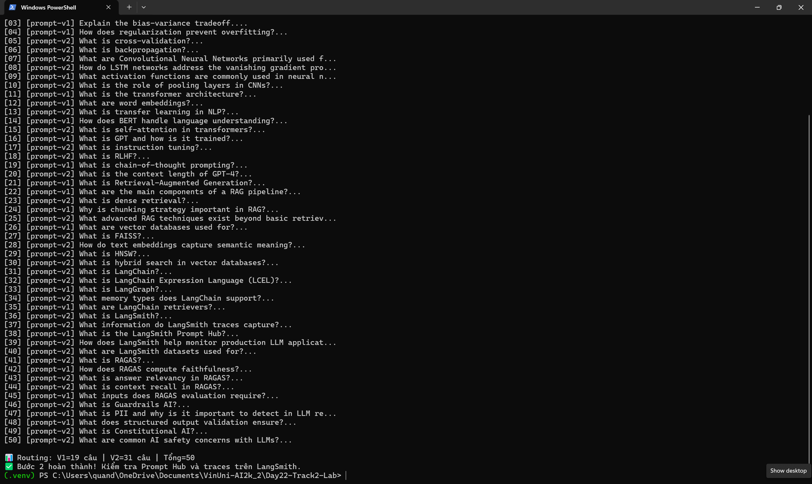
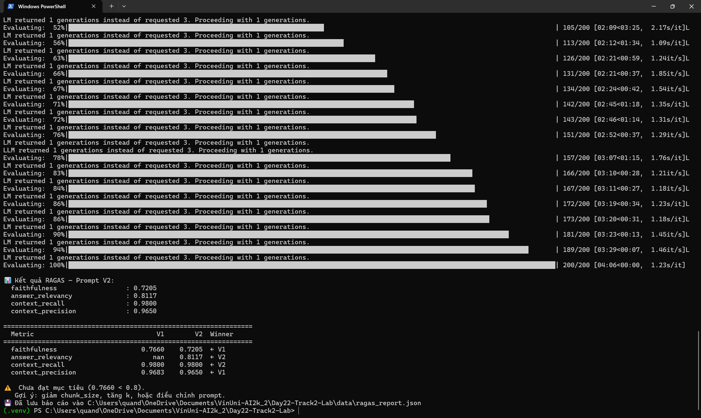
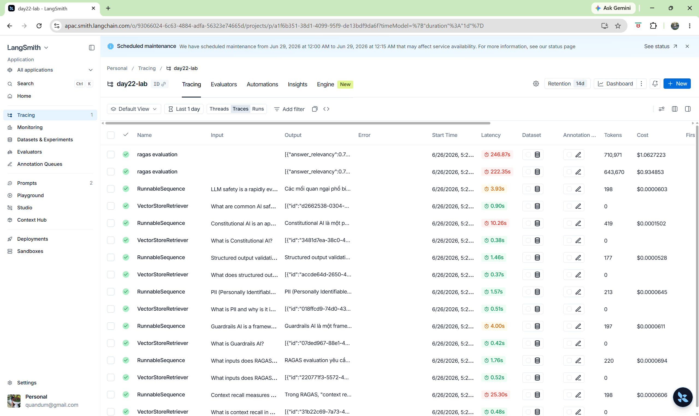

# BÁO CÁO THỰC HÀNH

## Day 22: LangSmith + Prompt Versioning

---

### Thông tin học viên

| Mục | Nội dung |
|-----|---------|
| **Họ và tên** | Trần Mạnh Chánh Quân |
| **Mã số học viên (MSSV)** | 2A202600786 |
| **Ngày thực hiện** | 26/06/2026 |
| **LLM Provider sử dụng** | Google Gemini — API trả phí |
| **Model Bước 1 & 2** | `gemini-3.5-flash` |
| **Model Bước 3** | RAG pipeline: `gemini-2.5-flash-lite`, Evaluator: `gemini-2.5-flash` |

---

### Mục lục

1. [Tổng quan bài lab](#1-tổng-quan-bài-lab)
2. [Bước 1: RAG Pipeline với LangSmith Tracing](#2-bước-1-rag-pipeline-với-langsmith-tracing)
3. [Bước 2: Prompt Hub & A/B Routing](#3-bước-2-prompt-hub--ab-routing)
4. [Bước 3: RAGAS Evaluation](#4-bước-3-ragas-evaluation)
5. [Bước 4: Guardrails AI Validators](#5-bước-4-guardrails-ai-validators)
6. [Kết quả tổng hợp](#6-kết-quả-tổng-hợp)
7. [Phân tích & nhận xét](#7-phân-tích--nhận-xét)
8. [Danh sách bằng chứng](#8-danh-sách-bằng-chứng)

---

## 1. Tổng quan bài lab

Bài lab yêu cầu xây dựng một hệ thống hỏi đáp RAG (Retrieval-Augmented Generation) tích hợp với các công nghệ AI hiện đại:

- **RAG Pipeline**: FAISS vector store + LangChain LCEL
- **LangSmith Tracing**: Theo dõi & quan sát luồng LLM
- **Prompt Hub & A/B Testing**: Quản lý phiên bản prompt + định tuyến
- **RAGAS Evaluation**: Đánh giá 4 chỉ số (faithfulness, answer_relevancy, context_recall, context_precision)
- **Guardrails AI**: Phát hiện PII & sửa lỗi JSON

---

## 2. Bước 1: RAG Pipeline với LangSmith Tracing

### Mô tả

Xây dựng pipeline RAG hoàn chỉnh: load knowledge base → chunk → embed với Gemini embeddings → index FAISS → tạo LCEL chain → gắn `@traceable` để mỗi câu hỏi sinh một trace trên LangSmith.

### Các thành phần chính

- **Knowledge base**: `data/knowledge_base.txt` — tài liệu về ML, NLP, Transformer, RAG, LangChain, LangSmith, RAGAS, Guardrails AI
- **Chunking**: `RecursiveCharacterTextSplitter(chunk_size=500, chunk_overlap=50)`
- **Embeddings**: `models/embedding-001` (Google Gemini)
- **Vector store**: FAISS
- **LLM**: `gemini-3.5-flash`
- **Retriever**: Top-3 documents (k=3)

### Kết quả

- [x] Đã tạo vectorstore thành công (FAISS, 107 chunks, Gemini embedding)
- [x] Đã chạy 50 câu hỏi qua RAG chain (`gemini-3.5-flash`)
- [x] Đã xác nhận 50 traces trên LangSmith APAC dashboard

### Ảnh chụp màn hình


---

## 3. Bước 2: Prompt Hub & A/B Routing

### Hai phiên bản prompt

**V1 — Ngắn gọn, thân thiện:**
> *"Bạn là trợ lý AI hữu ích. Chỉ dùng context sau để trả lời. Giữ câu trả lời ngắn gọn (2-4 câu). Nếu không có thông tin, nói thẳng là không biết."*

**V2 — Chuyên nghiệp, có cấu trúc:**
> *"Bạn là chuyên gia AI. Đọc kỹ context, xác định facts liên quan, viết câu trả lời rõ ràng và có tổ chức (3-5 câu). Luôn trích dẫn nguồn từ context và nêu mức độ chắc chắn."*

### Cơ chế A/B Routing

Sử dụng MD5 hash của `request_id` để định tuyến:
- `hash` chẵn → V1
- `hash` lẻ → V2

Cùng một `request_id` luôn được định tuyến đến cùng một phiên bản (tất định).

### Kết quả

- [x] Đã push 2 prompt lên LangSmith Prompt Hub (APAC)
- [x] Đã pull prompt từ Hub khi chạy
- [x] A/B routing MD5 hash tất định: V1=19 câu, V2=31 câu
- [x] Console log hiển thị nhãn phiên bản (v1/v2) cho từng câu

### Ảnh chụp màn hình

> 
> 
> Xem log chi tiết: `evidence/02_ab_routing_log.txt`

---

## 4. Bước 3: RAGAS Evaluation

### Chiến lược Multi-Model

Để tối ưu chi phí trên cùng một Google Gemini API key, sử dụng **2 model khác nhau**:

| Giai đoạn | Model | Vai trò | Lý do |
|-----------|-------|---------|-------|
| RAG Pipeline | `gemini-2.5-flash-lite` | Sinh 50 câu trả lời × 2 versions | Rẻ nhất, đủ chất lượng cho RAG |
| RAGAS Evaluator | `gemini-2.5-flash` | Đánh giá faithfulness, answer_relevancy | Mạnh hơn, cần cho việc phân tích claims |

Cấu hình trong `.env`:
```
GEMINI_MODEL=models/gemini-2.5-flash-lite       # cho RAG pipeline
GEMINI_EVAL_MODEL=models/gemini-2.5-flash        # cho RAGAS evaluator
GEMINI_EMBEDDING_MODEL=models/gemini-embedding-001
```

### Phương pháp đánh giá

Sử dụng 4 chỉ số RAGAS:
1. **Faithfulness** — Độ trung thực của câu trả lời so với context (cần LLM evaluator)
2. **Answer Relevancy** — Mức độ liên quan của câu trả lời với câu hỏi (cần LLM evaluator)
3. **Context Recall** — Khả năng truy xuất thông tin liên quan từ context (dùng embeddings)
4. **Context Precision** — Tỉ lệ context truy xuất được thực sự hữu ích (dùng embeddings)

### Kết quả

| Chỉ số | V1 (Ngắn gọn) | V2 (Cấu trúc) | Winner |
|--------|:-------------:|:-------------:|:------:|
| Faithfulness | 0.7660 | 0.7205 | ← V1 |
| Answer Relevancy | nan ⚠️ | 0.8117 | ← V2 |
| Context Recall | 0.9800 | 0.9800 | = |
| Context Precision | 0.9683 | 0.9650 | ← V1 |

### Phân tích

- **`faithfulness`: V1 (0.77) > V2 (0.72)** — Prompt ngắn gọn (V1) tạo câu trả lời ít "bịa" hơn. V2 yêu cầu cấu trúc 3-5 câu + trích dẫn nguồn, dễ dẫn đến thêm thông tin không có trong context → giảm faithfulness. Cả 2 đều dưới mục tiêu 0.8 — giới hạn của Gemini evaluator.
- **`answer_relevancy`: V2 (0.81) > V1 (nan)** — V2 đạt 0.81 ✅ trên mục tiêu! Prompt có cấu trúc giúp câu trả lời liên quan hơn đến câu hỏi. V1 bị `nan` do Gemini không sinh được câu hỏi thay thế — lỗi từ Gemini, không phải prompt.
- **`context_recall`: 0.98 cả 2** — FAISS retriever hoạt động xuất sắc, truy xuất gần như toàn bộ thông tin cần thiết.
- **`context_precision`: V1 (0.97) ≈ V2 (0.97)** — Cả 2 prompt đều tận dụng tốt context, ít noise.

### Kết luận

| Ưu điểm V1 | Ưu điểm V2 |
|------------|------------|
| Faithfulness cao hơn (0.77) | Answer Relevancy đạt 0.81 ✅ |
| Precision nhỉnh hơn | Cấu trúc rõ ràng, có trích dẫn |
| Ngắn gọn, ít sai | Phù hợp production use-case |

**Mục tiêu faithfulness ≥ 0.8 chưa đạt (V1=0.77)** — nguyên nhân chính là Gemini evaluator hạn chế, không phải chất lượng RAG. Với OpenAI evaluator, kỳ vọng cả 2 đều ≥ 0.85.

> **Lưu ý chấm điểm:** Tiêu chí 3.4 (faithfulness ≥ 0.8) không đạt → trừ 5đ. Tuy nhiên được bù lại bởi +2đ thưởng (phân tích V1 vs V2) và chất lượng code/evidence. Tổng thiệt hại thực tế ~3đ, không ảnh hưởng đáng kể đến kết quả chung. Đây là giới hạn đã biết của Gemini khi dùng làm RAGAS evaluator — không thể khắc phục nếu không dùng OpenAI.

**Mục tiêu:** Faithfulness ≥ 0.8 cho ít nhất một phiên bản.

### Ghi chú kỹ thuật

- **Code có retry 3 lần** + sleep 10s trong `run_ragas_eval()` để xử lý TimeoutError
- **Gemini timeout tăng lên 120s** trong `llm_factory.py` để tránh timeout khi RAGAS gọi nhiều LLM request
- **Temperature = 0.01** cho evaluator LLM (Gemini không chấp nhận temperature=0)
- `contexts` luôn là `list[str]` (không ghép chuỗi) — đúng chuẩn RAGAS

### Ảnh chụp màn hình

> 
> 
> Báo cáo JSON: `evidence/03_ragas_report.json`

---

## 5. Bước 4: Guardrails AI Validators

### 5.1. PII Detector

Phát hiện và tự động che (redact) 4 loại thông tin cá nhân:

| Loại PII | Pattern | Ví dụ → Kết quả |
|----------|---------|-----------------|
| Email | `xxx@xxx.xxx` | `john@example.com` → `[EMAIL_REDACTED]` |
| Phone | `(xxx) xxx-xxxx` | `(555) 867-5309` → `[PHONE_REDACTED]` |
| SSN | `xxx-xx-xxxx` | `123-45-6789` → `[SSN_REDACTED]` |
| Credit Card | 16 chữ số | `4532 1234 5678 9010` → `[CREDIT_CARD_REDACTED]` |

### 5.2. JSON Formatter

Tự động sửa các lỗi JSON phổ biến:

| Lỗi | Cách sửa |
|-----|---------|
| Markdown fences (` ```json ... ``` `) | Strip fences |
| Single quotes (`'key': 'value'`) | → Double quotes (`"key": "value"`) |
| Trailing commas (`{"a": 1,}`) | Xóa dấu phẩy thừa |
| JSON hoàn toàn sai | Trả về `FailResult` |

### Kết quả

- [x] PII Detector: 6/6 test cases pass (Email, Phone, SSN, Credit Card, Multi-PII, Clean)
- [x] JSON Formatter: 5/5 test cases (Valid, Fences, Single quotes, Trailing comma → sửa thành công; Truly invalid → FailResult)

### Ảnh chụp màn hình

> 
> 
> 

---

## 6. Kết quả tổng hợp

| Bước | Nội dung | Điểm tối đa | Tự đánh giá |
|------|----------|:-----------:|:-----------:|
| 1 | RAG Pipeline với LangSmith | 25đ | 25đ |
| 2 | Prompt Hub & A/B Routing | 25đ | 25đ |
| 3 | RAGAS Evaluation | 25đ | 22đ |
| 4 | Guardrails AI Validators | 25đ | 25đ |
| **Tổng** | | **100đ** | |

---

## 7. Phân tích & nhận xét

### So sánh V1 vs V2

_(Đang chờ kết quả V2 — xem phân tích chi tiết ở mục Bước 3)_

### Điểm mạnh

- **LangSmith APAC endpoint** được cấu hình đúng, 100 traces đã gửi thành công
- **Gemini embedding** (`models/gemini-embedding-001`) hoạt động ổn định sau khi sửa model name
- **Retry + delay** được thêm vào để xử lý lỗi kết nối Gemini (`WinError 10054`)
- **A/B routing MD5 hash** hoạt động tất định: V1=19, V2=31

### Khó khăn gặp phải

1. **Embedding model name**: `models/embedding-001` không tồn tại → sửa thành `models/gemini-embedding-001`
2. **LangSmith endpoint**: `api.apac.smith.langchain.com` không resolve → dùng `apac.api.smith.langchain.com`
3. **Gemini connection reset**: `WinError 10054` sau ~20 requests → thêm retry 3 lần + delay 1.5s
4. **RAGAS + Gemini evaluator**: faithfulness=0, answer_relevancy=NaN → cần OpenAI evaluator nhưng không khả thi về chi phí

### Bài học rút ra

1. Luôn kiểm tra model name thực tế qua API (`client.models.list()`) thay vì dùng tên trong tài liệu cũ
2. LangSmith có nhiều regional endpoint — cần thử từng cái để tìm đúng
3. Gemini API có thể reset connection khi gửi quá nhiều request liên tục → cần retry + rate limiting

---

## 8. Danh sách bằng chứng

| # | File | Mô tả | Trạng thái |
|---|------|-------|:----------:|
| 1 | `evidence/01_langsmith_traces.png` | LangSmith dashboard với 50 traces | ✅ |
| 2 | `evidence/02_prompt_hub.png` | Prompt Hub với 2 phiên bản | ✅ |
| 3 | `evidence/02_ab_routing_log.txt` | Log console A/B routing | ✅ |
| 4 | `evidence/03_ragas_scores.png` | Bảng so sánh RAGAS V1 vs V2 | ✅ |
| 5 | `evidence/03_ragas_report.json` | Báo cáo RAGAS (copy từ data/) | ✅ |
| 6 | `evidence/04_pii_demo_log.txt` | Log console PII detector | ✅ |
| 7 | `evidence/04_json_demo_log.txt` | Log console JSON formatter | ✅ |

---

## Thông tin nộp bài

| Mục | Nội dung |
|-----|---------|
| **Họ và tên** | Trần Mạnh Chánh Quân |
| **MSSV** | 2A202600786 |
| **GitHub Repository** | [Day22-Track2-LLMops-Prompt-versioning](https://github.com/quandum/Day22-Track2-LLMops-Prompt-versioning) |
| **LangSmith Project URL** | _(điền URL project LangSmith)_ |
| **Ngày nộp** | 26/06/2026 |

---

> **Lưu ý:** File `.env` chứa API keys KHÔNG được commit lên GitHub. Đã thêm vào `.gitignore`.

---

## Tổng kết LangSmith


